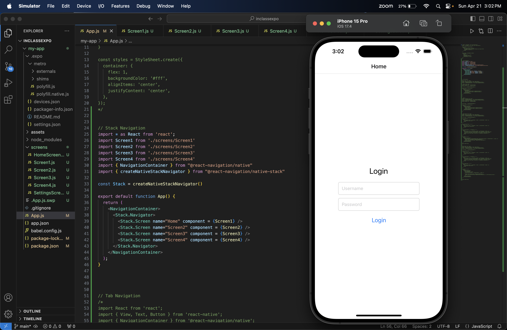
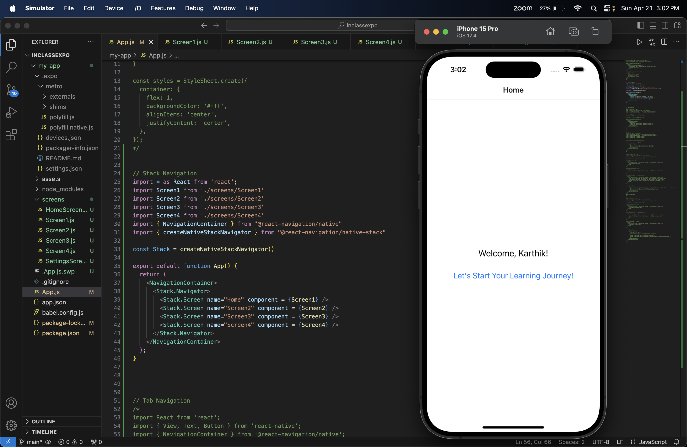
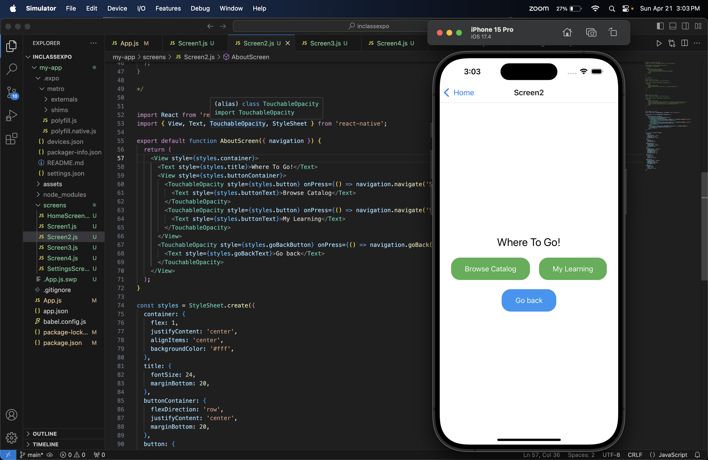
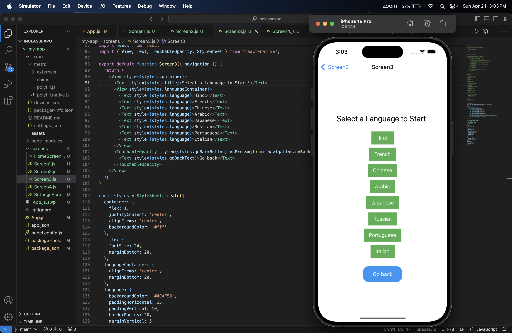
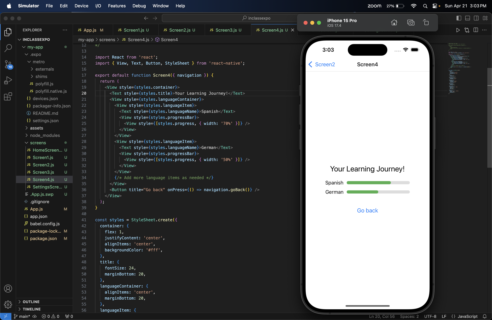

# TechM-personalmobileapp

# Language-Learning App

## [PersonalMobileApp-Githublink](https://github.com/dubbuday/TechM-personalmobileapp.git)

### Team-members
- Adarsh Reddy Dubbudu
- Pranay Ellendra
- Karthik Pavuluri

### Description

1. login page:

- In this image, the simulator screen shows a login page with fields for entering a username and password, along with a "Login" button.

2. Welcome Home Page:

- The code editor on the left shows the main App.js file, which sets up the navigation stack for different screens. The simulator on the right displays a home screen with a welcome message "Welcome, Karthik!" and a button "Let's Start Your Learning Journey!".

3. Navigation page:

- The code editor shows the Screen2.js file, which defines the "Where To Go!" screen. The simulator displays this screen with two buttons: "Browse Catalog" and "My Learning," along with a "Go back" button.

4. Catalog Page:

- This image displays a code editor window on the left and a mobile device simulator on the right. The simulator shows a screen with a title "Select a Language to Start!" followed by buttons for different language options such as Hindi, French, Chinese, Arabic, Japanese, Russian, Portuguese, and Italian. There is also a "Go back" button at the bottom.

5. Learning Page:

- This image presents the Screen4.js file in the code editor, which defines the "Your Learning Journey!" screen. The simulator displays this screen with two language options, Spanish and German, each with a progress bar. There is also a "Go back" button at the bottom.

### Conclusion:

- This app generation is the basic outline of the Learning application which consists of 4 different screens and stack navigation which is used in between the screens. The application uses an array instead of the database to store the login details of the user. 

